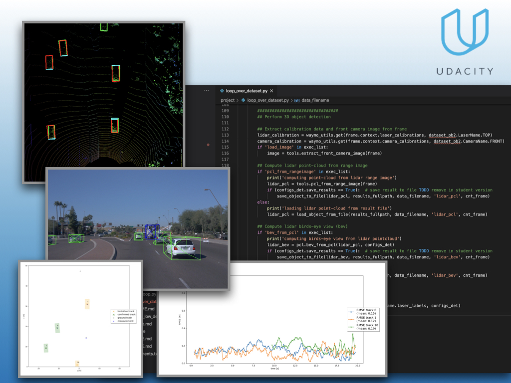
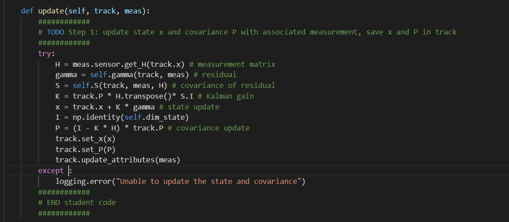
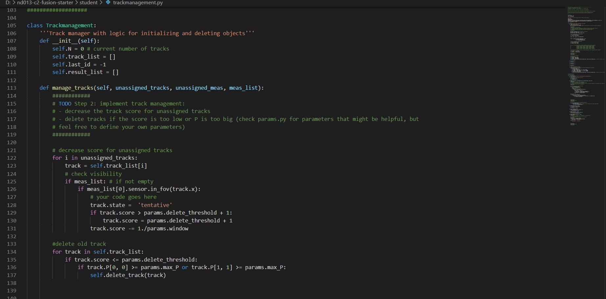
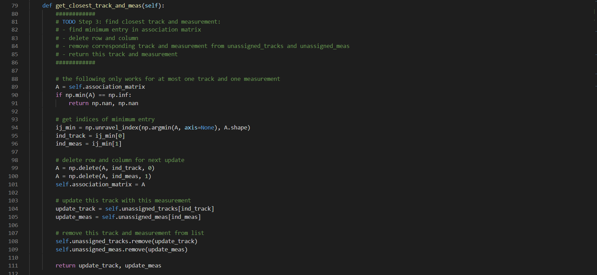
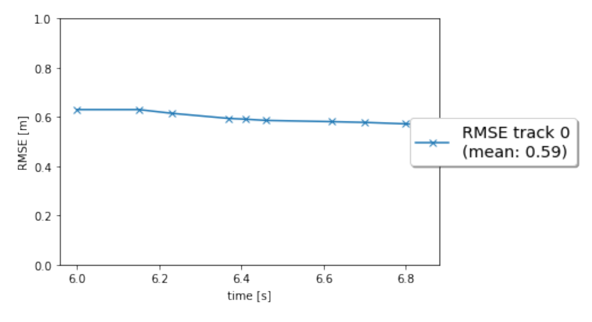
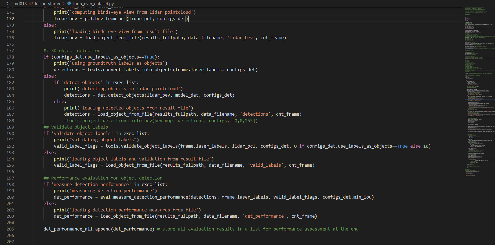

# SDCND : Sensor Fusion and Tracking

This is the project for the second course in the  [Udacity Self-Driving Car Engineer Nanodegree Program](https://www.udacity.com/course/c-plus-plus-nanodegree--nd213) : Sensor Fusion and Tracking. 

In this project, you'll fuse measurements from LiDAR and camera and track vehicles over time. You will be using real-world data from the Waymo Open Dataset, detect objects in 3D point clouds and apply an extended Kalman filter for sensor fusion and tracking.



The project consists of two major parts: 
1. **Object detection**: In this part, a deep-learning approach is used to detect vehicles in LiDAR data based on a birds-eye view perspective of the 3D point-cloud. Also, a series of performance measures is used to evaluate the performance of the detection approach. 
2. **Object tracking** : In this part, an extended Kalman filter is used to track vehicles over time, based on the lidar detections fused with camera detections. Data association and track management are implemented as well.

The following diagram contains an outline of the data flow and of the individual steps that make up the algorithm. 


Also, the project code contains various tasks, which are detailed step-by-step in the code. More information on the algorithm and on the tasks can be found in the Udacity classroom. 

## Project File Structure

📦project<br>
 ┣ 📂dataset --> contains the Waymo Open Dataset sequences <br>
 ┃<br>
 ┣ 📂misc<br>
 ┃ ┣ evaluation.py --> plot functions for tracking visualization and RMSE calculation<br>
 ┃ ┣ helpers.py --> misc. helper functions, e.g. for loading / saving binary files<br>
 ┃ ┗ objdet_tools.py --> object detection functions without student tasks<br>
 ┃ ┗ params.py --> parameter file for the tracking part<br>
 ┃ <br>
 ┣ 📂results --> binary files with pre-computed intermediate results<br>
 ┃ <br>
 ┣ 📂student <br>
 ┃ ┣ association.py --> data association logic for assigning measurements to tracks incl. student tasks <br>
 ┃ ┣ filter.py --> extended Kalman filter implementation incl. student tasks <br>
 ┃ ┣ measurements.py --> sensor and measurement classes for camera and lidar incl. student tasks <br>
 ┃ ┣ objdet_detect.py --> model-based object detection incl. student tasks <br>
 ┃ ┣ objdet_eval.py --> performance assessment for object detection incl. student tasks <br>
 ┃ ┣ objdet_pcl.py --> point-cloud functions, e.g. for birds-eye view incl. student tasks <br>
 ┃ ┗ trackmanagement.py --> track and track management classes incl. student tasks  <br>
 ┃ <br>
 ┣ 📂tools --> external tools<br>
 ┃ ┣ 📂objdet_models --> models for object detection<br>
 ┃ ┃ ┃<br>
 ┃ ┃ ┣ 📂darknet<br>
 ┃ ┃ ┃ ┣ 📂config<br>
 ┃ ┃ ┃ ┣ 📂models --> darknet / yolo model class and tools<br>
 ┃ ┃ ┃ ┣ 📂pretrained --> copy pre-trained model file here<br>
 ┃ ┃ ┃ ┃ ┗ complex_yolov4_mse_loss.pth<br>
 ┃ ┃ ┃ ┣ 📂utils --> various helper functions<br>
 ┃ ┃ ┃<br>
 ┃ ┃ ┗ 📂resnet<br>
 ┃ ┃ ┃ ┣ 📂models --> fpn_resnet model class and tools<br>
 ┃ ┃ ┃ ┣ 📂pretrained --> copy pre-trained model file here <br>
 ┃ ┃ ┃ ┃ ┗ fpn_resnet_18_epoch_300.pth <br>
 ┃ ┃ ┃ ┣ 📂utils --> various helper functions<br>
 ┃ ┃ ┃<br>
 ┃ ┗ 📂waymo_reader --> functions for light-weight loading of Waymo sequences<br>
 ┃<br>
 ┣ basic_loop.py<br>
 ┣ loop_over_dataset.py<br>


## Installation Instructions for Running Locally
### Cloning the Project
In order to create a local copy of the project, please click on "Code" and then "Download ZIP". Alternatively, you may of-course use GitHub Desktop or Git Bash for this purpose. 

### Python
The project has been written using Python 3.7. Please make sure that your local installation is equal or above this version. 

### Package Requirements
All dependencies required for the project have been listed in the file `requirements.txt`. You may either install them one-by-one using pip or you can use the following command to install them all at once: 
`pip3 install -r requirements.txt` 

### Waymo Open Dataset Reader
The Waymo Open Dataset Reader is a very convenient toolbox that allows you to access sequences from the Waymo Open Dataset without the need of installing all of the heavy-weight dependencies that come along with the official toolbox. The installation instructions can be found in `tools/waymo_reader/README.md`. 

### Waymo Open Dataset Files
This project makes use of three different sequences to illustrate the concepts of object detection and tracking. These are: 
- Sequence 1 : `training_segment-1005081002024129653_5313_150_5333_150_with_camera_labels.tfrecord`
- Sequence 2 : `training_segment-10072231702153043603_5725_000_5745_000_with_camera_labels.tfrecord`
- Sequence 3 : `training_segment-10963653239323173269_1924_000_1944_000_with_camera_labels.tfrecord`

To download these files, you will have to register with Waymo Open Dataset first: [Open Dataset – Waymo](https://waymo.com/open/terms), if you have not already, making sure to note "Udacity" as your institution.

Once you have done so, please [click here](https://console.cloud.google.com/storage/browser/waymo_open_dataset_v_1_2_0_individual_files) to access the Google Cloud Container that holds all the sequences. Once you have been cleared for access by Waymo (which might take up to 48 hours), you can download the individual sequences. 

The sequences listed above can be found in the folder "training". Please download them and put the `tfrecord`-files into the `dataset` folder of this project.


### Pre-Trained Models
The object detection methods used in this project use pre-trained models which have been provided by the original authors. They can be downloaded [here](https://drive.google.com/file/d/1Pqx7sShlqKSGmvshTYbNDcUEYyZwfn3A/view?usp=sharing) (darknet) and [here](https://drive.google.com/file/d/1RcEfUIF1pzDZco8PJkZ10OL-wLL2usEj/view?usp=sharing) (fpn_resnet). Once downloaded, please copy the model files into the paths `/tools/objdet_models/darknet/pretrained` and `/tools/objdet_models/fpn_resnet/pretrained` respectively.

### Using Pre-Computed Results

In the main file `loop_over_dataset.py`, you can choose which steps of the algorithm should be executed. If you want to call a specific function, you simply need to add the corresponding string literal to one of the following lists: 

- `exec_data` : controls the execution of steps related to sensor data. 
  - `pcl_from_rangeimage` transforms the Waymo Open Data range image into a 3D point-cloud
  - `load_image` returns the image of the front camera

- `exec_detection` : controls which steps of model-based 3D object detection are performed
  - `bev_from_pcl` transforms the point-cloud into a fixed-size birds-eye view perspective
  - `detect_objects` executes the actual detection and returns a set of objects (only vehicles) 
  - `validate_object_labels` decides which ground-truth labels should be considered (e.g. based on difficulty or visibility)
  - `measure_detection_performance` contains methods to evaluate detection performance for a single frame

In case you do not include a specific step into the list, pre-computed binary files will be loaded instead. This enables you to run the algorithm and look at the results even without having implemented anything yet. The pre-computed results for the mid-term project need to be loaded using [this](https://drive.google.com/drive/folders/1-s46dKSrtx8rrNwnObGbly2nO3i4D7r7?usp=sharing) link. Please use the folder `darknet` first. Unzip the file within and put its content into the folder `results`.

- `exec_tracking` : controls the execution of the object tracking algorithm

- `exec_visualization` : controls the visualization of results
  - `show_range_image` displays two LiDAR range image channels (range and intensity)
  - `show_labels_in_image` projects ground-truth boxes into the front camera image
  - `show_objects_and_labels_in_bev` projects detected objects and label boxes into the birds-eye view
  - `show_objects_in_bev_labels_in_camera` displays a stacked view with labels inside the camera image on top and the birds-eye view with detected objects on the bottom
  - `show_tracks` displays the tracking results
  - `show_detection_performance` displays the performance evaluation based on all detected 
  - `make_tracking_movie` renders an output movie of the object tracking results

Even without solving any of the tasks, the project code can be executed. 

The final project uses pre-computed lidar detections in order for all students to have the same input data. If you use the workspace, the data is prepared there already. Otherwise, [download the pre-computed lidar detections](https://drive.google.com/drive/folders/1IkqFGYTF6Fh_d8J3UjQOSNJ2V42UDZpO?usp=sharing) (~1 GB), unzip them and put them in the folder `results`.

## External Dependencies
Parts of this project are based on the following repositories: 
- [Simple Waymo Open Dataset Reader](https://github.com/gdlg/simple-waymo-open-dataset-reader)
- [Super Fast and Accurate 3D Object Detection based on 3D LiDAR Point Clouds](https://github.com/maudzung/SFA3D)
- [Complex-YOLO: Real-time 3D Object Detection on Point Clouds](https://github.com/maudzung/Complex-YOLOv4-Pytorch)


## License
[License](LICENSE.md)


# Self-Driving Car Beta Testing Nanodegree 

This is a template submission for the  second course in the  [Udacity Self-Driving Car Engineer Nanodegree Program](https://www.udacity.com/course/c-plus-plus-nanodegree--nd213) : Sensor Fusion and Tracking. 


## Sensor Fusion and Object detection

We have used the [Waymo Open Dataset's](https://console.cloud.google.com/storage/browser/waymo_open_dataset_v_1_2_0_individual_files) real-world data and applied an extended Kalman fusion filter for tracking several vehicles in this project. The following are the tasks completed:
- Building Kalman Filter system to track an object
- Object tracking and updating tracks (creating and deleting)
- Understanding the association between the data (sensor)
- Added camera sensor fusion based on lidar fusion 

The project can be run by running 

```
python loop_over_dataset.py
```
All training/inference is done on GTX 2060 in windows 10 machine.

## Step-1: Extended Kalman Filter

In the filter.py file, EKF is used.

- We first design the system states [x, y, z, vx, vy, vz], process model, and constant velocity model.
- Then we calculate the matrix (system matrix) for the 3D process models with constant velocity and noise covariances. This is required for computing state h(x) and Jacobian H
- For current state calculation, h(x), and the Jacobian H function are evaluated.
- The Kalman gain is computed and is used for updating the state and covariance.

This is shown in the followin image


The analysis of rmse with current time is shown in the below image (single tracking).


## Step-2: Track Management

The track management is analysed next, and the tracklist can handle several objects. One object is shown as a track in the device architecture.
We transfer the track and measurement details to Kalman filter to update the particular worker on the track.


The following steps were taken for this:

- The track is first initialized with unassigned lidar calculation
- If the scores on the track are correlated with measurement, then the corresponding scores will be increased and vice versa
- There is a track ranking which changes the conditions of the track.
- If the score is below certain three-point and the state balance is greater than a threshold , then the track is not removed for further consideration.

This is shown in the trackmanagement.py script:



The following image shows the rmse plot for single tracking .


## Step-3: Data Association

In this step, the closest neighbor association correctly matches several measurements to several tracks. In association.py, data association is introduced.
The following steps have been taken:

- We build  a matrix with all tracks and overviews open.
- We calculate the distance of Mahalanobis Distance for each track measurement.
- To exclude unlikely track pairs, use the hypothesis test Chi-Square.
- We choose the pair with the smallest Mahalanobis Distance, update Kalman Filter, and delete the relation matrix with the appropriate row and column.
- A measurement lies inside a track's gate if the Mahalanobis distance is smaller than the threshold calculated from the inverse cumulative chi squared dstribution. 

  distribution
The following image shows the MHD being applied for getting the closest track measurement:


The following graph is plotted.


The following graph shows the rmse with data association:




## Step-4: Camera Sensor fusion

Now we will be adding to the Kalman filter.The main assumption is the center of the 3d space bounding box for a car which is following the center of the 2d imagery of the vehicle. This assertion is approximately correct, however, for a front camera does not always be accurate.
The implementation consists of projection matrix which converts the points from 3d space into 2d geometry in the picture . We use the partial derivatives (x,y,z) for measuring the the model in parameters (u,v). The noise is also measured (R).If the tracking status is in FOV(Field of View) then we can accept the measurement-track pair else we can reject it.


## Difficulties Faced in Project

The implementation of ekf, track management, data association, and camera-lidar fusion are all well guided in the lectures. However it was difficult to implement the camera measuring model. When projecting a 3d point into a 2d point, there are transformations in the camera axis. However, the coding of the project was discovered and the problem was solved.For the project, a pre-computed result is needed. However, the pre-computed result files do not correspond to the load filename of the loop_over_dataset.py file. For using the files, we  modified the filenames according to the pre-computed result. This is shown in the following lines in the "loop_over_dataset.py " file.


Fig: modified loop_over_dataset for pre-computed result

## Benefits in Camera-Lidar Fusion tracking over Lidar-only tracking

From the project, it is understandable that for a stabilized tracking, sensor fusion should combine multiple sensors. Cameras may offer textured and color/brightness/contrast based imaages that Lidar does not provide .Lidar is extremely beneficial for low brightness /visibility or in blurry conditions such as foggy/rainy weather conditions.The most important aspect of Lidar is the spatial projection which is better than a camera.Lidar can seemlessly navigate to the required orientation. Ideally a combined approach of Resnet architectures combined with Lidar can provide better results. Inclusion of camera fusion trackign can produce a better geometric project matrix for the sensors to detect and operate on.

## Real-life challenges:

A sensor-fusion systemcould be confronted with a variety of real-world issues such as :

- Multiple tracks and measurements provide a precise correlation. The thresholds for gatting should be properly set to avoid un-necessary wrong correlations.
- The measurement noise configuration is insufficient to provide a precise project result. In reality, rather than setting a standardized noise variance for a sensor, it's best if each measurement has its noise variance.Individual noise variances provide a better vaiation as compared to a combined variance on the sensor.

This project eliminates the issue of extrinsic parameter tuning, which is one method for camera and 
LiDAR fusion. These extrinsic parameters are defined since we are using a public dataset for this 
experiment.

## Improvement opportunity:

As already stated, the project should carry out the Camera-LiDAR Fusion Monitoring. And also, A 3D measuring model of the real camera sound can assist with the fusion effect, we can fit actual 3d points in the lidar point cloud to the vehicle target pixels.It is best suited to use a camera sound for providing individual noise variances and also for better projection matrix creation.


