# SDCND : Sensor Fusion and Tracking

This is the project for the second course in the  [Udacity Self-Driving Car Engineer Nanodegree Program](https://www.udacity.com/course/c-plus-plus-nanodegree--nd213) : Sensor Fusion and Tracking. 

In this project, you'll fuse measurements from LiDAR and camera and track vehicles over time. You will be using real-world data from the Waymo Open Dataset, detect objects in 3D point clouds and apply an extended Kalman filter for sensor fusion and tracking.


The project consists of two major parts: 
1. **Object detection**: In this part, a deep-learning approach is used to detect vehicles in LiDAR data based on a birds-eye view perspective of the 3D point-cloud. Also, a series of performance measures is used to evaluate the performance of the detection approach. 
2. **Object tracking** : In this part, an extended Kalman filter is used to track vehicles over time, based on the lidar detections fused with camera detections. Data association and track management are implemented as well.

The following diagram contains an outline of the data flow and of the individual steps that make up the algorithm. 


Also, the project code contains various tasks, which are detailed step-by-step in the code. More information on the algorithm and on the tasks can be found in the Udacity classroom. 

## Project File Structure

📦project<br>
 ┣ 📂dataset --> contains the Waymo Open Dataset sequences <br>
 ┃<br>
 ┣ 📂misc<br>
 ┃ ┣ evaluation.py --> plot functions for tracking visualization and RMSE calculation<br>
 ┃ ┣ helpers.py --> misc. helper functions, e.g. for loading / saving binary files<br>
 ┃ ┗ objdet_tools.py --> object detection functions without student tasks<br>
 ┃ ┗ params.py --> parameter file for the tracking part<br>
 ┃ <br>
 ┣ 📂results --> binary files with pre-computed intermediate results<br>
 ┃ <br>
 ┣ 📂student <br>
 ┃ ┣ association.py --> data association logic for assigning measurements to tracks incl. student tasks <br>
 ┃ ┣ filter.py --> extended Kalman filter implementation incl. student tasks <br>
 ┃ ┣ measurements.py --> sensor and measurement classes for camera and lidar incl. student tasks <br>
 ┃ ┣ objdet_detect.py --> model-based object detection incl. student tasks <br>
 ┃ ┣ objdet_eval.py --> performance assessment for object detection incl. student tasks <br>
 ┃ ┣ objdet_pcl.py --> point-cloud functions, e.g. for birds-eye view incl. student tasks <br>
 ┃ ┗ trackmanagement.py --> track and track management classes incl. student tasks  <br>
 ┃ <br>
 ┣ 📂tools --> external tools<br>
 ┃ ┣ 📂objdet_models --> models for object detection<br>
 ┃ ┃ ┃<br>
 ┃ ┃ ┣ 📂darknet<br>
 ┃ ┃ ┃ ┣ 📂config<br>
 ┃ ┃ ┃ ┣ 📂models --> darknet / yolo model class and tools<br>
 ┃ ┃ ┃ ┣ 📂pretrained --> copy pre-trained model file here<br>
 ┃ ┃ ┃ ┃ ┗ complex_yolov4_mse_loss.pth<br>
 ┃ ┃ ┃ ┣ 📂utils --> various helper functions<br>
 ┃ ┃ ┃<br>
 ┃ ┃ ┗ 📂resnet<br>
 ┃ ┃ ┃ ┣ 📂models --> fpn_resnet model class and tools<br>
 ┃ ┃ ┃ ┣ 📂pretrained --> copy pre-trained model file here <br>
 ┃ ┃ ┃ ┃ ┗ fpn_resnet_18_epoch_300.pth <br>
 ┃ ┃ ┃ ┣ 📂utils --> various helper functions<br>
 ┃ ┃ ┃<br>
 ┃ ┗ 📂waymo_reader --> functions for light-weight loading of Waymo sequences<br>
 ┃<br>
 ┣ basic_loop.py<br>
 ┣ loop_over_dataset.py<br>


## Installation Instructions for Running Locally
### Cloning the Project
In order to create a local copy of the project, please click on "Code" and then "Download ZIP". Alternatively, you may of-course use GitHub Desktop or Git Bash for this purpose. 

### Python
The project has been written using Python 3.7. Please make sure that your local installation is equal or above this version. 

### Package Requirements
All dependencies required for the project have been listed in the file `requirements.txt`. You may either install them one-by-one using pip or you can use the following command to install them all at once: 
`pip3 install -r requirements.txt` 

### Waymo Open Dataset Reader
The Waymo Open Dataset Reader is a very convenient toolbox that allows you to access sequences from the Waymo Open Dataset without the need of installing all of the heavy-weight dependencies that come along with the official toolbox. The installation instructions can be found in `tools/waymo_reader/README.md`. 

### Waymo Open Dataset Files
This project makes use of three different sequences to illustrate the concepts of object detection and tracking. These are: 
- Sequence 1 : `training_segment-1005081002024129653_5313_150_5333_150_with_camera_labels.tfrecord`
- Sequence 2 : `training_segment-10072231702153043603_5725_000_5745_000_with_camera_labels.tfrecord`
- Sequence 3 : `training_segment-10963653239323173269_1924_000_1944_000_with_camera_labels.tfrecord`

To download these files, you will have to register with Waymo Open Dataset first: [Open Dataset – Waymo](https://waymo.com/open/terms), if you have not already, making sure to note "Udacity" as your institution.

Once you have done so, please [click here](https://console.cloud.google.com/storage/browser/waymo_open_dataset_v_1_2_0_individual_files) to access the Google Cloud Container that holds all the sequences. Once you have been cleared for access by Waymo (which might take up to 48 hours), you can download the individual sequences. 

The sequences listed above can be found in the folder "training". Please download them and put the `tfrecord`-files into the `dataset` folder of this project.


### Pre-Trained Models
The object detection methods used in this project use pre-trained models which have been provided by the original authors. They can be downloaded [here](https://drive.google.com/file/d/1Pqx7sShlqKSGmvshTYbNDcUEYyZwfn3A/view?usp=sharing) (darknet) and [here](https://drive.google.com/file/d/1RcEfUIF1pzDZco8PJkZ10OL-wLL2usEj/view?usp=sharing) (fpn_resnet). Once downloaded, please copy the model files into the paths `/tools/objdet_models/darknet/pretrained` and `/tools/objdet_models/fpn_resnet/pretrained` respectively.

### Using Pre-Computed Results

In the main file `loop_over_dataset.py`, you can choose which steps of the algorithm should be executed. If you want to call a specific function, you simply need to add the corresponding string literal to one of the following lists: 

- `exec_data` : controls the execution of steps related to sensor data. 
  - `pcl_from_rangeimage` transforms the Waymo Open Data range image into a 3D point-cloud
  - `load_image` returns the image of the front camera

- `exec_detection` : controls which steps of model-based 3D object detection are performed
  - `bev_from_pcl` transforms the point-cloud into a fixed-size birds-eye view perspective
  - `detect_objects` executes the actual detection and returns a set of objects (only vehicles) 
  - `validate_object_labels` decides which ground-truth labels should be considered (e.g. based on difficulty or visibility)
  - `measure_detection_performance` contains methods to evaluate detection performance for a single frame

In case you do not include a specific step into the list, pre-computed binary files will be loaded instead. This enables you to run the algorithm and look at the results even without having implemented anything yet. The pre-computed results for the mid-term project need to be loaded using [this](https://drive.google.com/drive/folders/1-s46dKSrtx8rrNwnObGbly2nO3i4D7r7?usp=sharing) link. Please use the folder `darknet` first. Unzip the file within and put its content into the folder `results`.

- `exec_tracking` : controls the execution of the object tracking algorithm

- `exec_visualization` : controls the visualization of results
  - `show_range_image` displays two LiDAR range image channels (range and intensity)
  - `show_labels_in_image` projects ground-truth boxes into the front camera image
  - `show_objects_and_labels_in_bev` projects detected objects and label boxes into the birds-eye view
  - `show_objects_in_bev_labels_in_camera` displays a stacked view with labels inside the camera image on top and the birds-eye view with detected objects on the bottom
  - `show_tracks` displays the tracking results
  - `show_detection_performance` displays the performance evaluation based on all detected 
  - `make_tracking_movie` renders an output movie of the object tracking results

Even without solving any of the tasks, the project code can be executed. 

The final project uses pre-computed lidar detections in order for all students to have the same input data. If you use the workspace, the data is prepared there already. Otherwise, [download the pre-computed lidar detections](https://drive.google.com/drive/folders/1IkqFGYTF6Fh_d8J3UjQOSNJ2V42UDZpO?usp=sharing) (~1 GB), unzip them and put them in the folder `results`.

## External Dependencies
Parts of this project are based on the following repositories: 
- [Simple Waymo Open Dataset Reader](https://github.com/gdlg/simple-waymo-open-dataset-reader)
- [Super Fast and Accurate 3D Object Detection based on 3D LiDAR Point Clouds](https://github.com/maudzung/SFA3D)
- [Complex-YOLO: Real-time 3D Object Detection on Point Clouds](https://github.com/maudzung/Complex-YOLOv4-Pytorch)


## License
[License](LICENSE.md)


# Self-Driving Car Beta Testing Nanodegree 

This is a template submission for the midterm second course in the  [Udacity Self-Driving Car Engineer Nanodegree Program](https://www.udacity.com/course/c-plus-plus-nanodegree--nd213) : 3D Object Detection (Midterm). 


## 3D Object detection

We have used the [Waymo Open Dataset's](https://console.cloud.google.com/storage/browser/waymo_open_dataset_v_1_2_0_individual_files) real-world data and used 3d point cloud for lidar based object detection. 

- Configuring the ranges channel to 8 bit and view the range /intensity image (ID_S1_EX1)
- Use the Open3D library to display the lidar point cloud on a 3d viewer and identifying 10 images from point cloud.(ID_S1_EX2)
- Create Birds Eye View perspective (BEV) of the point cloud,assign lidar intensity values to BEV,normalize the heightmap of each BEV (ID_S2_EX1,ID_S2_EX2,ID_S2_EX3)
- In addition to YOLO, use the [repository](https://review.udacity.com/github.com/maudzung/SFA3D) and add parameters ,instantiate fpn resnet model(ID_S3_EX1)
- Convert BEV coordinates into pixel coordinates and convert model output to bounding box format  (ID_S3_EX2)
- Compute intersection over union, assign detected objects to label if IOU exceeds threshold (ID_S4_EX1)
- Compute false positives and false negatives, precision and recall(ID_S4_EX2,ID_S4_EX3)


The project can be run by running 

```
python loop_over_dataset.py
```
All training/inference is done on GTX 2060 in windows 10 machine.


## Step-1: Compute Lidar point cloud from Range Image

In this we are first previewing the range image and convert range and intensity channels to 8 bit format. After that, we use the openCV library to stack the range and intensity channel vertically to visualize the image.

- Convert "range" channel to 8 bit
- Convert "intensity" channel to 8 bit
- Crop range image to +/- 90 degrees  left and right of forward facing x axis
- Stack up range and intensity channels vertically in openCV

The changes are made in 'loop_over_dataset.py'
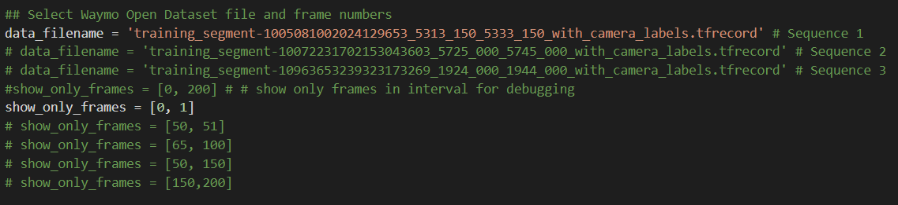


The changes are made in "objdet_pcl.py"


The range image sample:

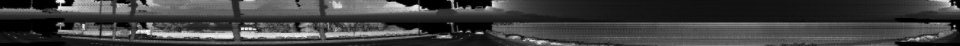

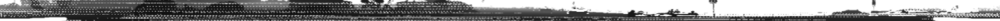

For the next part, we use the Open3D library to display the lidar point cloud on a 3D viewer and identify 10 images from point cloud
- Visualize the point cloud in Open3D
- 10 examples from point cloud  with varying degrees of visibility

The changes are made in 'loop_over_dataset.py'


The changes are made in "objdet_pcl.py"
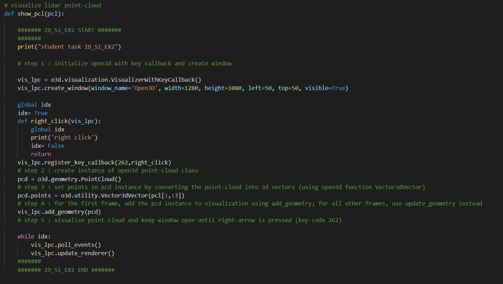


Point cloud images

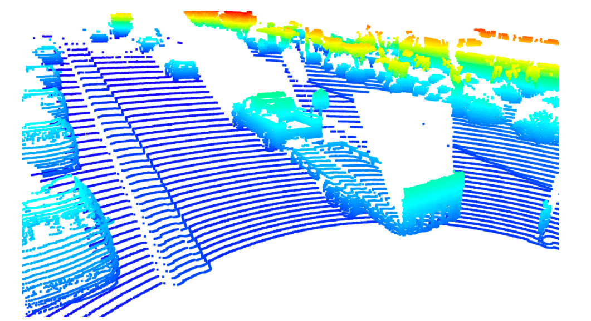


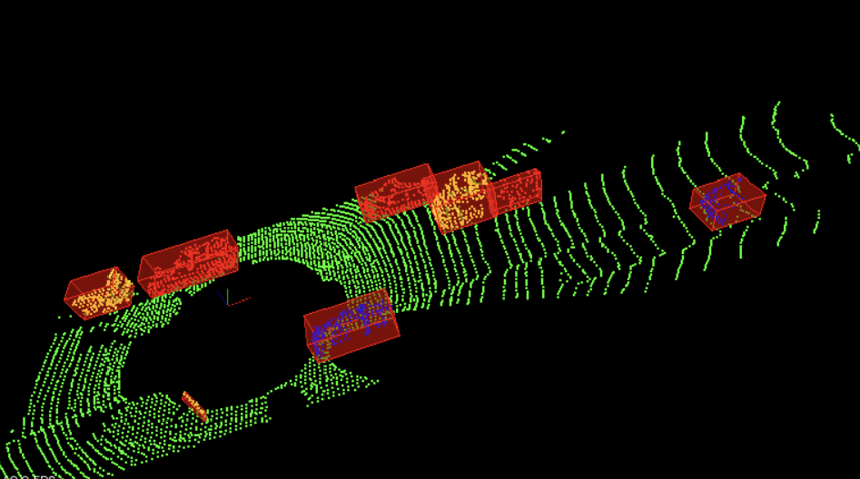


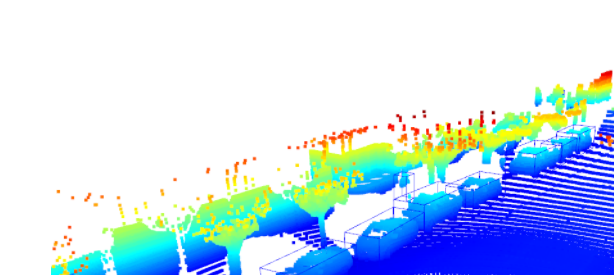

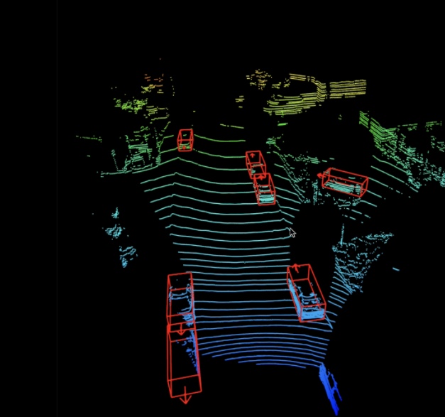

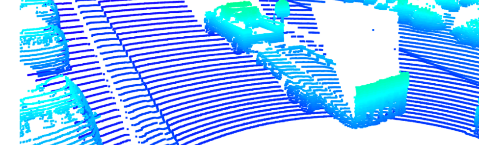


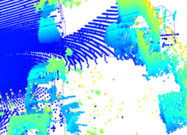


Stable features include the tail lights, the rear bumper  majorly. In some cases the additional features include the headover lights, car front lights, rear window shields. These are identified through the intensity channels . The chassis of the car is the most prominent identifiable feature from the lidar perspective. The images are analysed with different settings and the rear lights are the major stable components, also the bounding boxes are correctly assigned to the cars (used from Step-3).


## Step-2: Creaate BEV from Lidar PCL

In this case, we are:
- Converting the coordinates to pixel values
- Assigning lidar intensity values to the birds eye view BEV mapping
- Using sorted and pruned point cloud lidar from the  previous task
- Normalizing the height map in the BEV
- Compute and map the intensity values

The changes are in the 'loop_over_dataset.py'


The changes are also in the "objdet_pcl.py"


A sample preview of the BEV:


A preview of the intensity layer:

The 'lidar_pcl_top' is used in this case, shown in the Figure:


The corresponding intensity channel:


The corresponding normalized height channel:


## Step-3: Model Based Object Detection in BEV Image

Here we are using the cloned [repo](https://github.com/maudzung/SFA3D) ,particularly the test.py file  and extracting the relevant configurations from 'parse_test_configs()'  and added them in the 'load_configs_model' config structure.

- Instantiating the fpn resnet model from the cloned repository configs
- Extracting 3d bounding boxes from the responses
- Transforming the pixel to vehicle coordinates
- Model output tuned to the bounding box format [class-id, x, y, z, h, w, l, yaw]

The changes are in "loop_over_dataset.py"


The changes for the detection are inside the "objdet_detect.py" file:


As the model input is a three-channel BEV map, the detected objects will be returned with coordinates and properties in the BEV coordinate space. Thus, before the detections can move along in the processing pipeline, they need to be converted into metric coordinates in vehicle space.

A sample preview of the bounding box images:

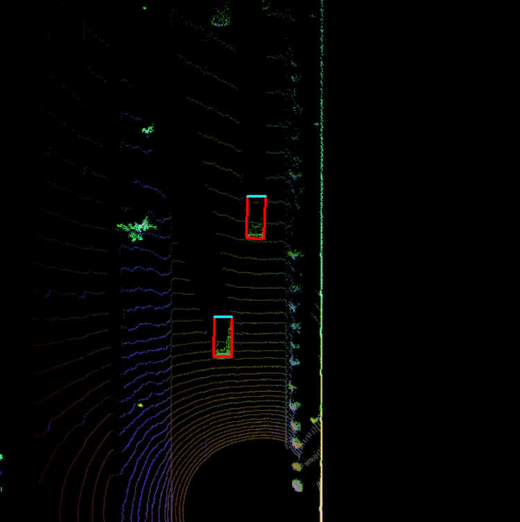


## Step-4: Performance detection for 3D Object Detection

In this step, the performance is computed by getting the IOU  between labels and detections to get the false positive and false negative values.The task is to compute the geometric overlap between the bounding boxes of labels and the detected objects:

- Assigning a detected object to a label if IOU exceeds threshold
- Computing the degree of geometric overlap
- For multiple matches objects/detections pair with maximum IOU are kept
- Computing the false negative and false positive values
- Computing precision and recall over the false positive and false negative values

The changes in the code are:

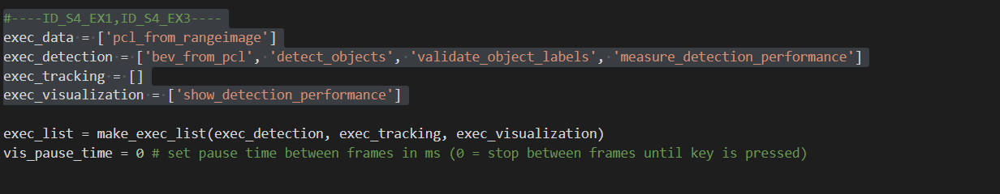

The changes for "objdet_eval.py" where the precision and recall are calculated as functions of false positives and negatives:

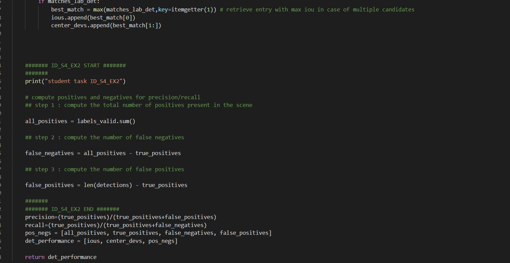


The precision recall curve is plotted showing similar results of precision =0.9506 and recall=0.944


In the next step, we set the 
```python
configs_det.use_labels_as_objects=True
```
 which results in precision and recall values as 1.This is shown in the following image:


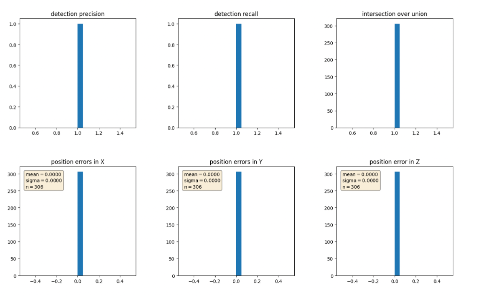


## Summary of Lidar based 3D Object Detection

From the project, it is understandable that for a stabilized tracking, lidar should be used . The conversion of range data to point cloud through spatial volumes, or points (or CNN networks) are important for further analysis. The usage of resnet/darknet and YOLO to convert these high dimensional point cloud representations to object detections through bounding boxes is essential for 3D object detection. Evaluating the performance with help of maximal IOU mapping ,mAP, and representing the precision/recall of the bounding boxes are essential to understand the effectiveness of Lidar based detection.
