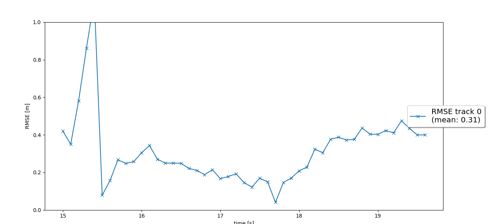
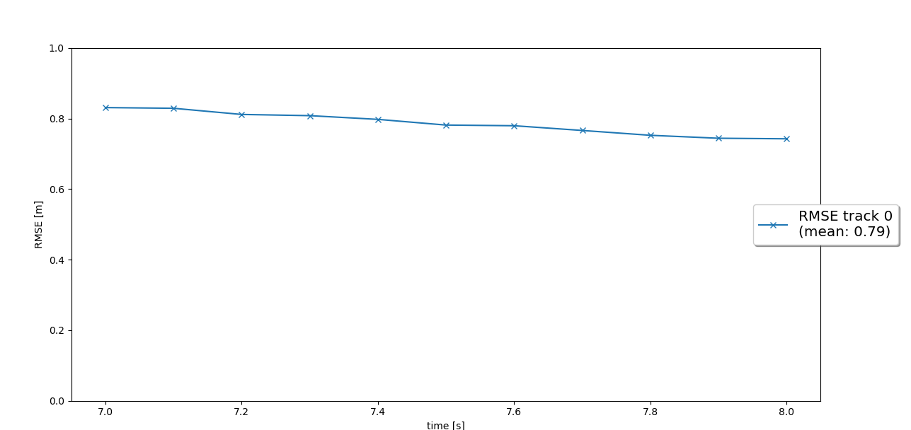
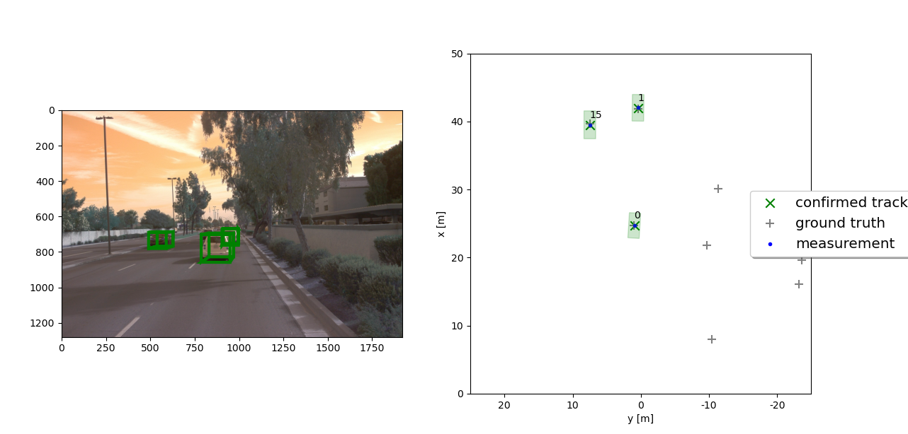

# Writeup: Track 3D-Objects Over Time

Please use this starter template to answer the following questions:

### 1. Write a short recap of the four tracking steps and what you implemented there (filter, track management, association, camera fusion). Which results did you achieve? Which part of the project was most difficult for you to complete, and why?


### 2. Do you see any benefits in camera-lidar fusion compared to lidar-only tracking (in theory and in your concrete results)? 


### 3. Which challenges will a sensor fusion system face in real-life scenarios? Did you see any of these challenges in the project?


### 4. Can you think of ways to improve your tracking results in the future?


# Self-Driving Car Beta Testing Nanodegree 

This is a template submission for the  second course in the  [Udacity Self-Driving Car Engineer Nanodegree Program](https://www.udacity.com/course/c-plus-plus-nanodegree--nd213) : Sensor Fusion and Tracking. 


## Sensor Fusion and Object detection

We have used the [Waymo Open Dataset's](https://console.cloud.google.com/storage/browser/waymo_open_dataset_v_1_2_0_individual_files) real-world data and applied an extended Kalman fusion filter for tracking several vehicles in this project. The following are the tasks completed:
- Building Kalman Filter system to track an object
- Object tracking and updating tracks (creating and deleting)
- Understanding the association between the data (sensor)
- Added camera sensor fusion based on lidar fusion 

The project can be run by running 

```
python loop_over_dataset.py
```
All training/inference is done on GTX 2060 in windows 10 machine.

## Step-1: Extended Kalman Filter

In the filter.py file, EKF is used.

- We first design the system states [x, y, z, vx, vy, vz], process model, and constant velocity model.
- Then we calculate the matrix (system matrix) for the 3D process models with constant velocity and noise covariances. This is required for computing state h(x) and Jacobian H
- For current state calculation, h(x), and the Jacobian H function are evaluated.
- The Kalman gain is computed and is used for updating the state and covariance.

This is shown in the followin image


The analysis of rmse with current time is shown in the below image (single tracking).




## Step-2: Track Management

The track management is analysed next, and the tracklist can handle several objects. One object is shown as a track in the device architecture.
We transfer the track and measurement details to Kalman filter to update the particular worker on the track.


The following steps were taken for this:

- The track is first initialized with unassigned lidar calculation
- If the scores on the track are correlated with measurement, then the corresponding scores will be increased and vice versa
- There is a track ranking which changes the conditions of the track.
- If the score is below certain three-point and the state balance is greater than a threshold , then the track is not removed for further consideration.

This is shown in the trackmanagement.py script:


The following image shows the rmse plot for single tracking .




## Step-3: Data Association

In this step, the closest neighbor association correctly matches several measurements to several tracks. In association.py, data association is introduced.
The following steps have been taken:

- We build  a matrix with all tracks and overviews open.
- We calculate the distance of Mahalanobis Distance for each track measurement.
- To exclude unlikely track pairs, use the hypothesis test Chi-Square.
- We choose the pair with the smallest Mahalanobis Distance, update Kalman Filter, and delete the relation matrix with the appropriate row and column.

The following image shows the MHD being applied for getting the closest track measurement:


The following graph is plotted.




## Step-4: Camera Sensor fusion

Now we will be adding to the Kalman filter.The main assumption is the center of the 3d space bounding box for a car which is following the center of the 2d imagery of the vehicle. This assertion is approximately correct, however, for a front camera does not always be accurate.
The implementation consists of projection matrix which converts the points from 3d space into 2d geometry in the picture . We use the partial derivatives (x,y,z) for measuring the the model in parameters (u,v). The noise is also measured (R).If the tracking status is in FOV(Field of View) then we can accept the measurement-track pair else we can reject it.


## Difficulties Faced in Project

The implementation of ekf, track management, data association, and camera-lidar fusion are all well guided in the lectures. However it was difficult to implement the camera measuring model. When projecting a 3d point into a 2d point, there are transformations in the camera axis. However, the coding of the project was discovered and the problem was solved.For the project, a pre-computed result is needed. However, the pre-computed result files do not correspond to the load filename of the loop_over_dataset.py file. For using the files, we  modified the filenames according to the pre-computed result. This is shown in the following lines in the "loop_over_dataset.py " file.


Fig: modified loop_over_dataset for pre-computed result

## Benefits in Camera-Lidar Fusion tracking over Lidar-only tracking

From the project, it is understandable that for a stabilized tracking, sensor fusion should combine multiple sensors. Cameras may offer textured and color/brightness/contrast based imaages that Lidar does not provide .Lidar is extremely beneficial for low brightness /visibility or in blurry conditions such as foggy/rainy weather conditions.The most important aspect of Lidar is the spatial projection which is better than a camera.Lidar can seemlessly navigate to the required orientation. Ideally a combined approach of Resnet architectures combined with Lidar can provide better results. Inclusion of camera fusion trackign can produce a better geometric project matrix for the sensors to detect and operate on.

## Real-life challenges:

A sensor-fusion systemcould be confronted with a variety of real-world issues such as :

- Multiple tracks and measurements provide a precise correlation. The thresholds for gatting should be properly set to avoid un-necessary wrong correlations.
- The measurement noise configuration is insufficient to provide a precise project result. In reality, rather than setting a standardized noise variance for a sensor, it's best if each measurement has its noise variance.Individual noise variances provide a better vaiation as compared to a combined variance on the sensor.

This project eliminates the issue of extrinsic parameter tuning, which is one method for camera and 
LiDAR fusion. These extrinsic parameters are defined since we are using a public dataset for this 
experiment.

## Improvement opportunity:

As already stated, the project should carry out the Camera-LiDAR Fusion Monitoring. And also, A 3D measuring model of the real camera sound can assist with the fusion effect, we can fit actual 3d points in the lidar point cloud to the vehicle target pixels.It is best suited to use a camera sound for providing individual noise variances and also for better projection matrix creation.


